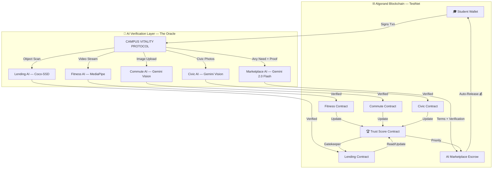

# 🚀 Campus Vitality Protocol (CVP)

<div align="center">

### **The Decentralized Trust Layer for Student Life**

**Built on Algorand · Powered by Gemini AI · Verified by Community**

[](https://testnet.algoexplorer.io/)
[](https://ai.google.dev/)
[](https://react.dev/)
[](https://nodejs.org/)

> **Hackathon:** Hackspiration '26 · **Tracks:** AI & Automation + Future of Finance

</div>

---

## 🧬 What Is CVP?

CVP is not just an app — it is a **Decentralized Protocol** that transforms every aspect of campus life into a verifiable, trustless, AI-governed ecosystem.

**The core idea:** Every student action — workouts, commutes, lending, civic sense, marketplace transactions — is **verified by AI in real-time** and **recorded immutably on Algorand**, building a living, breathing **On-Chain Reputation Score** that unlocks real-world utility.

> 💡 *Imagine a campus where your honesty is provable, your efforts are rewarded automatically, and any need you have — from lost keys to calculus notes — is fulfilled through an AI that builds smart contracts on the fly.*

### What Makes This Different?

| Traditional Campus Apps | CVP |
|:---|:---|
| Manual verification (humans check everything) | **AI verifies everything autonomously** |
| Trust is assumed | **Trust is proven on-chain** |
| Fixed features, fixed categories | **AI generates infinite use-cases dynamically** |
| Payments require middlemen | **Algorand auto-releases payments on proof** |
| Reputation is invisible | **On-chain Trust Score with real utility** |

---

## 🧠 The #1 Innovation: AI-Governed Marketplace

> *"What if any student need — no matter how unique — could become a self-executing smart contract in seconds?"*

This is not a marketplace. This is an **AI-powered autonomous economy.** Students don't browse listings — they **describe any need in plain English**, and Gemini AI instantly:

1. 🔍 **Understands** the request and classifies it — lost items, notes, errands, tutoring, food, transport, *anything*
2. 📝 **Generates smart contract terms** — specific, verifiable proof requirements tailored to that exact need
3. 🔒 **Locks payment** on Algorand as programmable escrow
4. 🤖 **Verifies proof autonomously** — when someone fulfills the need and submits evidence (photos + descriptions), Gemini AI acts as a **decentralized oracle**, analyzing the proof against the contract terms
5. 💰 **Releases payment instantly** — no human approval, no disputes, no middlemen

### Why It's Limitless

There are **no categories, no templates, no pre-built forms.** A student can say:

- *"Find my lost blue notebook near the library"*
- *"Explain quantum entanglement to me in Hindi"*
- *"Pick up my laundry from Block C"*
- *"Need 2024 calculus notes from Professor Khan"*
- *"Drive me from Gate 1 to Hostel D"*
- *"Fix this bug in my Python code"*

...and the AI builds a **unique, enforceable contract** for each one. **If you can describe it, the AI can govern it.** The sky is the limit.

> 🔥 **Think Uber, but for literally anything** — and the entire dispute resolution, payment, and verification layer is replaced by AI + blockchain.

### The Oracle Pattern
Gemini AI acts as a **trustless verification oracle** — the same architecture used by Chainlink, but powered by **multimodal AI** that can simultaneously verify photos, text, and context. This isn't a chatbot — it's a **decentralized judge** that reads evidence and enforces contracts.

**Tech Stack:** Gemini 2.0 Flash (term generation + multimodal proof verification) → Algorand (escrow payments) → MongoDB (state management)

---

## 🔥 All 8 Innovations

### 1. 🧠 AI-Governed Marketplace — *The Limitless Exchange*
*(See above)* — Any human need becomes a self-executing AI smart contract.

### 2. 🏋️ Proof of Workout — *Turn Sweat Into On-Chain Reputation*
**MediaPipe AI** tracks your body pose in real-time through a standard webcam. Every push-up is counted, verified, and minted to your on-chain profile. No gym scanners, no manual logging — just point your camera and go.

### 3. 🚗 Proof of Eco-Travel — *AI-Verified Green Commute*
Share a ride to campus → **Gemini Vision AI** verifies the carpool evidence → Smart Contract releases payout to the driver and mints **Eco Points** to all passengers. GPS geofencing ensures you actually arrived at **VIT Pune**.

### 4. 📦 Trustless Asset Lending — *Zero-Collateral DeFi for Students*
Borrow expensive lab equipment **without locking collateral** — if your Trust Score is high enough. **Coco-SSD (TensorFlow)** scans the item's condition upon return via object detection. The escrow auto-refunds based on AI verification.

> This solves the **over-collateralization problem** in DeFi. Instead of locking assets, students stake their **Reputation.**
> `If Trust_Score > 50 → Collateral = 0 ALGO`. This is **Identity-Based DeFi**.

### 5. 🏙️ Civic Sense Reporting — *Blockchain-Verified Community Service*
See a pothole, garbage pile, or broken bench? Report it with a photo → AI verifies the civic issue → Earn **Civic Points** that boost your Trust Score. Making the campus better is now a provably rewarded activity.

### 6. 🏆 Hostel Leagues & Gamification — *Compete, Climb, Earn*
Hostels compete against each other on aggregated fitness, civic, and eco scores. Individual students climb **Global Leaderboards** across categories. Top performers unlock **Validator Status** — the right to become a Human Oracle and earn extra rewards for verifying edge cases.

### 7. 🏗️ Infrastructure Market (Canteen DAO) — *Crowd-Staked Campus Upgrades*
Students crowd-fund campus infrastructure directly with ALGO. Want a new coffee machine in the canteen? Stake ALGO → Funds stream to vendor only when target is met → The machine dispenses coffee only to NFT contributors. **LogicSigs (Smart Signatures)** power the machine's own on-chain wallet.

### 8. 🌐 Cross-Chain Identity (State Proofs) — *Your Reputation Travels With You*
Your Trust Score isn't trapped on Algorand. Using **Algorand State Proofs (ASP)**, export your reputation as a cryptographic proof to get loans on Ethereum, Solana, or any chain. Your on-chain identity is **portable, immutable, and universally verifiable**.

---

## 💡 The Core Engine: Trust Score Protocol

Most campus apps are isolated silos. CVP unifies them into a single **On-Chain Identity**.

```
┌────────────────────────────────────────────────┐
│              TRUST SCORE PROTOCOL              │
│                                                │
│   🏋️ Fitness  ──┐                             │
│   🚗 Commute  ──┤                             │
│   📦 Lending  ──┼── AI Verifies ──→ On-Chain  │
│   🏙️ Civic    ──┤     Each Action    Trust    │
│   🧠 Market   ──┤                    Score    │
│   🏆 League   ──┘                             │
│                                                │
│   High Trust Score = Real Utility:             │
│   • Zero-collateral borrowing                  │
│   • Validator status (earn as Human Oracle)    │
│   • Priority in marketplace fulfillment        │
│   • Cross-chain identity export                │
│                                                │
│   Hybrid Verification:                         │
│   • AI (Gemini + TensorFlow) does first pass   │
│   • Top students = "Human Oracles" for edges   │
└────────────────────────────────────────────────┘
```

---

## 💎 Complete Feature Map

### 🤖 Track: AI & Automation

| Feature | AI Engine | What Happens | On-Chain Effect |
|:---|:---|:---|:---|
| **Fitness Arena** | MediaPipe Pose | Webcam counts push-ups in real-time | Mints "Strength" to profile |
| **Commute Pool** | Gemini Vision + GPS | Verifies shared rides to VIT Pune | Escrow payout to driver + Eco points |
| **Asset Lending** | Coco-SSD (TensorFlow) | Scans item condition on return | Auto-refund collateral |
| **AI Marketplace** | Gemini 2.0 Flash | Generates contract terms + verifies proof | Escrow payment auto-release |
| **Civic Arena** | Gemini Vision | Verifies civic issue reports (photos) | Civic points to Trust Score |

### 💰 Track: Future of Finance

| Feature | Algorand Tech | Innovation |
|:---|:---|:---|
| **AI Marketplace** | Escrow Payments | AI builds contracts for infinite use-cases |
| **Zero-Collateral DeFi** | Local State | Trust Score replaces locked collateral |
| **Infrastructure Market** | LogicSigs | Crowd-staked campus upgrades with DAO |
| **Cross-Chain Identity** | State Proofs (ASP) | Portable reputation across blockchains |
| **Proof of Burn Tokenomics** | $BURN Token | Sweat → deflationary token → campus rewards |

### 🏗️ Platform Features

| Feature | Description |
|:---|:---|
| **Dashboard** | Central hub — all arenas at a glance with quick-access tiles |
| **Global Leaderboard** | Rankings across Fitness, Civic, Eco, Trust — with hostel filtering |
| **Hostel Leagues** | Hostels compete on aggregated scores — inter-hostel championships |
| **Dynamic Profile** | On-chain identity NFT showing all earned stats and reputation |
| **My Wallet** | Algorand wallet integration — balances, transactions, ALGO management |
| **Reputation Page** | Detailed Trust Score breakdown with history and level progression |
| **Validator Node** | Top students become Human Oracles — verify edge cases, earn rewards |
| **Admin Console** | Administrative panel for managing games, users, and system state |

---

## 🏗️ Architecture



### Tech Stack

| Layer | Technology |
|:---|:---|
| **Frontend** | React 18 + TypeScript + Vite + TailwindCSS |
| **Backend** | Node.js + Express + Socket.IO |
| **Database** | MongoDB (Mongoose ODM) |
| **Blockchain** | Algorand TestNet (algosdk + PyTeal) |
| **AI — Vision** | Gemini 2.0 Flash (multimodal analysis) |
| **AI — Pose** | MediaPipe (real-time body tracking) |
| **AI — Object** | Coco-SSD / TensorFlow.js (object detection) |
| **Wallet** | Pera Wallet + Defly Wallet (@txnlab/use-wallet-react) |
| **Maps** | Leaflet.js (geolocation + route visualization) |

---

## 🏆 Why We Win (Evaluation Criteria)

### 1. Technical Implementation & Code Quality
- **4 distinct AI engines** working as verification oracles — not just chatbots
- **Smart Contracts** in PyTeal with Inner Transactions, Box Storage, Local State
- **Full-stack**: React + Node.js + MongoDB + Algorand — production-grade architecture
- **16 pages**, each with real functionality — no mockups, no placeholders

### 2. Effective Use of Algorand Features
- **AI-Governed Escrow** — Payments lock on-chain, released only on AI verification
- **Box Storage** — Global order book stored directly on-chain
- **Local State** — Trust Score as soulbound, on-chain reputation
- **State Proofs** — Cross-chain identity export (designed)
- **3.3s Finality** — Real-time verification feedback loops

### 3. Relevance to Problem Statement
**Problem:** "Lack of trust, manual verification, and data tampering" in campus systems.

**Solution:** CVP removes the manual verifier entirely.
- *Did you exercise?* → **MediaPipe counts your reps.**
- *Did you return the laptop?* → **Coco-SSD scans it.**
- *Did you really carpool?* → **Gemini Vision confirms it.**
- *Did they find your lost keys?* → **Gemini AI verifies the proof and releases your payment.**
- *Are you trustworthy?* → **Your on-chain Trust Score proves it immutably.**

### 4. Feasibility & Scalability
- **Works today** — The prototype runs on TestNet with standard webcams and phones. No hardware cost.
- **Phase 1 (VIT Pune):** Pilot with Gym & Hostel
- **Phase 2 (Inter-College):** Hostel Leagues — colleges compete on fitness/eco/civic scores
- **Phase 3 (National):** Trust Score becomes a **standard hiring metric for integrity**

---

## 🚀 Quick Start (For Judges)

### Prerequisites
- **Node.js** (v18+)
- **MongoDB** (local or Docker)
- **Algorand Wallet** (Pera Mobile App) connected to **TestNet**
- **TestNet ALGO**: [Algorand Dispenser](https://bank.testnet.algorand.network/)

### 1. Clone & Install
```bash
git clone https://github.com/miran786/PushBet--Algorand.git
cd PushBet--Algorand
npm install
cd server && npm install && cd ..
```

### 2. Configure Environment

**Root `.env`:**
```env
MNEMONIC="your_25_word_mnemonic"
ALGOD_SERVER="https://testnet-api.algonode.cloud"
ALGOD_PORT=443
```

**`server/.env`:**
```env
MONGO_URI=mongodb://localhost:27017/miran_db
PORT=8000
GEMINI_API_KEY="YOUR_GEMINI_API_KEY"
```

> Get a free Gemini API key from [Google AI Studio](https://aistudio.google.com/apikey)

### 3. Database Setup
```bash
# Start MongoDB (Docker)
docker run -d -p 27017:27017 --name miran_mongo mongo:latest

# Seed test data
cd server && node seed-db.js
```

### 4. Run
```bash
# Terminal 1: Backend
cd server && node server.js

# Terminal 2: Frontend
npm run dev
```

Open **http://localhost:5173**

---

## 🧪 Demo Flow (How to Test)

| # | Feature | Steps |
|:---|:---|:---|
| 1 | **AI Marketplace** | Marketplace → "Post a Need" → Type *"need 2024 calculus notes"* → Watch AI generate contract terms → Post it → Browse Needs to see it live |
| 2 | **Fitness Arena** | Fitness → Enable webcam → Do push-ups → Watch AI count in real-time |
| 3 | **Commute Pool** | Commute Arena → "I Need a Ride" → Start Trip → Verify Arrival (Gemini AI) |
| 4 | **Asset Lending** | Asset Arena → "Borrow Item" → Trust Score > 50 = Zero Collateral! |
| 5 | **Civic Sense** | Civic Arena → Report an issue with a photo → AI verifies |
| 6 | **Leaderboard** | Leaderboard → See rankings across Fitness, Civic, Eco, Trust |
| 7 | **Profile** | Profile → See your Dynamic Identity NFT and reputation stats |

---

## 📜 Smart Contracts (Deployed to TestNet)

| Contract | Testnet App ID | Description |
|:---|:---|:---|
| **Trust Score** | `755297339` | Stores User Reputation (Local State) |
| **Commute** | `755297342` | Handles ride escrow & payouts |
| **AI Marketplace** | `755297353` | AI-Governed Escrow — Gemini generates terms & verifies proof |
| **Asset Lending** | `755412952` | Trustless borrowing with AI condition verification |

---

## 📁 Project Structure

```
PushBet--Algorand/
├── src/app/
│   ├── pages/               # 16 full-featured pages
│   │   ├── Dashboard.tsx     # Central hub
│   │   ├── Marketplace.tsx   # AI-Governed Marketplace
│   │   ├── Arena.tsx         # Fitness (Proof of Workout)
│   │   ├── CommuteArena.tsx  # Commute Pool (Eco-Travel)
│   │   ├── AssetArena.tsx    # Asset Lending
│   │   ├── CivicArena.tsx    # Civic Sense Reporting
│   │   ├── Leaderboard.tsx   # Global Rankings
│   │   ├── HostelLeague.tsx  # Inter-Hostel Competition
│   │   ├── Profile.tsx       # Dynamic Identity NFT
│   │   ├── Reputation.tsx    # Trust Score Breakdown
│   │   ├── ValidatorNode.tsx # Human Oracle Interface
│   │   └── ...
│   ├── components/           # Reusable UI components
│   ├── context/              # Auth & Wallet providers
│   └── routes.ts             # Application routing
├── server/
│   ├── controllers/          # API logic + Gemini AI integration
│   ├── models/               # MongoDB schemas (User, Need, Claim, etc.)
│   ├── routes/               # Express route definitions
│   └── server.js             # Backend entry point
├── contracts/                # PyTeal smart contracts
│   ├── trust_score.py
│   ├── marketplace_contract.py
│   ├── asset_escrow.py
│   └── commute_checkin.py
└── scripts/                  # Deployment & testing utilities
```

---

<div align="center">

### 🌟 The Future of Campus Life is Trustless, AI-Governed, and On-Chain.

**CVP doesn't just digitize campus processes — it makes trust a *verifiable, automated, and portable* asset.**

*Built with ❤️ for Hackspiration '26*

</div>

---

### License
MIT
