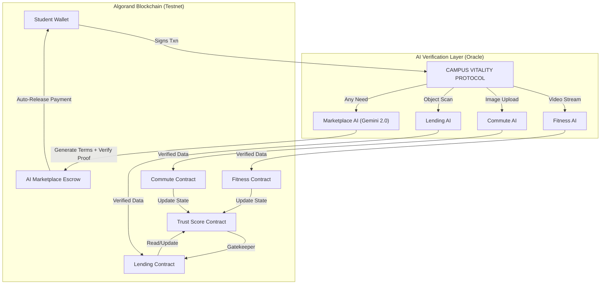

# 🚀 Campus Vitality Protocol (CVP)
### The Decentralized Trust Layer for Student Life
**Built on Algorand | Powered by AI | Verified by Community**

> **Hackathon Submission:** "Hackspiration '26"
> **Tracks:** AI & Automation + Future of Finance
> **Vision:** A trustless, self-governing ecosystem for campus life.

CVP is not just an app; it is a **Decentralized Protocol** that gamifies and verifies student activities (Fitness, Commute, Lending) to build an on-chain **Reputation Score** — and now features an **AI-Governed Marketplace** where any human need becomes an instant, verifiable smart contract.

---

## 🏆 Evaluation Criteria Mapping (Why We Win)

### 1. Technical Implementation & Code Quality
*   **AI Integration:** We utilize **MediaPipe** (Pose Detection), **Gemini Vision 1.5** (Context Analysis), and **Coco-SSD** (Object Detection) to create a robust "Oracle Layer" that feeds real-world data to the blockchain.
*   **Smart Contracts:** Written in **PyTeal**, utilizing advanced features like Inner Transactions and Local State for reputation tracking.
*   **Frontend:** A responsive, modern React application with real-time feedback loops.

### 2. Effective Use of Algorand Features
We don't just use Algorand for payments; we leverage its unique capabilities:
*   **AI-Governed Escrow:** Our **Marketplace** uses Algorand payments as programmable escrow — funds lock on-chain and only release when Gemini AI autonomously verifies proof of fulfillment.
*   **Box Storage:** Used to store the **Global Order Book** and complex validation data directly on-chain.
*   **State Proofs (Planned):** Designed to export the "Trust Score" as a cross-chain identity proof.
*   **Low Latency (3.3s):** Essential for "Real-Time" verification in the Fitness Arena.

### 3. Relevance to Problem Statement
*   **Problem:** "Lack of trust, manual verification, and data tampering" in campus systems.
*   **Solution:** CVP removes the "manual verifier".
    *   *Did you clean your room?* AI verifies it.
    *   *Did you return the laptop?* AI scans it.
    *   *Are you a good student?* Your on-chain **Trust Score** proves it immutably.

### 4. Feasibility & Scalability
*   **Feasibility:** The prototype works *today* on Testnet. It uses standard webcams and existing phones—no hardware cost.
*   **Scalability:**
    *   **Phase 1 (VIT Pune):** Pilot with Gym & Hostel.
    *   **Phase 2 (Inter-College):** "Hostel Leagues" where colleges compete on fitness/eco-scores.
    *   **Phase 3 (National):** The "Trust Score" becomes a standard hiring metric for integrity.

---

## 💡 The Core Innovation: "Trust Score Protocol"

Most campus apps are isolated silos. CVP unifies them into a single **On-Chain Identity**.

**1. The "Trust Score" (Soulbound Token):**
*   Every verified action mints **Trust Points** to your profile.
*   **High Trust Score = Real Utility:**
    *   **Zero-Collateral Borrowing:** If Trust > 90, borrow expensive lab equipment without locking 5 ALGO.
    *   **Validator Status:** Top-tier students become "Human Oracles" to verify others.

**2. The "Student Validator Node" (Decentralized AI):**
*   **Hybrid Verification:** AI (Gemini/TensorFlow) does the first pass.
*   **Human Consensus:** For edge cases, top-ranking students verify claims (e.g., "Is this room actually clean?").

---

## 🔥 Innovations (Why We Win)

### 1. 🧠 **AI-Governed Marketplace — The Sky Is The Limit**
> *"What if any student need — no matter how unique — could become a self-executing smart contract in seconds?"*

This is not a marketplace. This is an **AI-powered autonomous economy.** Students don't browse listings — they **describe any need in plain English**, and Gemini AI instantly:
1.  **Understands** the request and classifies it (lost items → notes → errands → tutoring → anything)
2.  **Generates smart contract terms** — specific, verifiable proof requirements tailored to that exact need
3.  **Locks payment** on Algorand as programmable escrow
4.  **Verifies proof autonomously** — when someone fulfills the need and submits evidence (photos, descriptions), Gemini AI acts as a **decentralized oracle**, analyzing the proof against the contract terms
5.  **Releases payment instantly** — no human approval, no disputes, no middlemen

*   **Why it's limitless:** There are no categories, no templates, no pre-built forms. A student can say *"find my lost blue notebook near the library"* or *"explain quantum entanglement to me in Hindi"* or *"pick up my laundry from Block C"* — and the AI builds a unique, enforceable contract for each one. **If you can describe it, the AI can govern it.**
*   **Tech Stack:** Gemini 2.0 Flash (term generation + proof verification) → Algorand (escrow payments) → MongoDB (state management)
*   **The Oracle Pattern:** Gemini AI acts as a trustless verification oracle — the same pattern used by Chainlink, but powered by multimodal AI that can verify *photos, text, and context* simultaneously.

> 💡 **Think Uber, but for literally anything** — and the entire dispute resolution, payment, and verification layer is replaced by AI + blockchain.

---

### 2. **Zero-Collateral DeFi (Based on AI Reputation)**
We solve the "Over-collateralization" problem in DeFi. Instead of locking assets, students stake their **Reputation**.
*   **Tech:** Our Lending Contract reads the **Local State (Trust Score)** from the Trust Protocol.
*   **Logic:** `If Trust_Score > 50: Collateral = 0`. This is true **Identity-Based DeFi**.

### 3. **"Proof of Burn" Tokenomics**
Turn sweat into a deflationary asset.
*   **Mechanism:** AI verifies pushups -> Mints `$BURN` tokens.
*   **Utility:** Tokens must be *burned* to redeem campus rewards, creating a circular economy.

### 4. **Cross-Chain Identity (State Proofs)**
Your reputation travels with you.
*   **Tech:** **Algorand State Proofs (ASP)**.
*   **Future:** Export your high Trust Score as a cryptographic proof to get loans on Ethereum or Solana.

### 5. **Hyper-Local Crowd-Staking (The Canteen DAO)**
Allow students to crowd-fund campus infrastructure directly.
*   **Scenario:** "We want a new Coffee Machine." Students stake ALGO; funds stream to vendor only when target is met.
*   **Algorand Feature:** **LogicSigs (Smart Signatures)**. The machine has its own wallet that only dispenses coffee to NFT contributors.

---

## 💎 Key Features & Tracks

### 🧘 Track 2: AI & Automation
#### **A. Fitness Arena (Proof of Workout)**
*   **Tech:** **MediaPipe AI** tracks body pose in real-time.
*   **Action:** Counts push-ups via webcam.
*   **Result:** Mints "Strength" metadata to your profile.

#### **B. Commute Pool (Proof of Eco-Travel)**
*   **Tech:** **Gemini AI Vision** + **Geolocation**.
*   **Action:** Verifies you are sharing a ride (bus/carpool) to campus.
*   **Result:** Smart Contract releases payout to driver & mints "Eco" points.
*   **Testnet App ID:** `755297342`

#### **C. Asset Lending (Trustless Borrowing)**
*   **Tech:** **Coco-SSD (TensorFlow)** object detection.
*   **Action:** Verifies item condition upon return (Laptop, Phone).
*   **Result:** Auto-refunds collateral.

### 💰 Track 1: Future of Finance
#### **D. AI-Governed Marketplace (The Limitless Exchange)**
*   **Tech:** **Gemini 2.0 Flash** (AI Oracle) + **Algorand Escrow Payments**.
*   **Action:** Describe ANY need → AI builds contract terms → someone fulfills it → AI verifies proof → payment auto-releases.
*   **Innovation:** No fixed categories, no templates — the AI governs an infinite design space of human needs.
*   **Examples:** *"Find my lost keys"*, *"Need 2024 calculus notes"*, *"Deliver food to my dorm"*, *"Tutor me in Python for 1 hour"*
*   **Testnet App ID:** `755297353`

#### **E. Hyper-Local Crowd-Staking (The Canteen DAO)**
Allow students to crowd-fund campus infrastructure directly.
*   **Scenario:** "We want a new Coffee Machine." Students stake ALGO; funds stream to vendor only when target is met.
*   **Algorand Feature:** **LogicSigs (Smart Signatures)**. The machine has its own wallet that only dispenses coffee to NFT contributors.

---

## 🏗️ Architecture



---

## 🚀 Quick Start (For Judges)

### Prerequisites
- **Node.js** (v18+)
- **Algorand Wallet** (Pera Mobile App recommended) connected to **TestNet**.
- **TestNet ALGO**: Get free funds from the [Algorand Dispenser](https://bank.testnet.algorand.network/).

### 1. Clone & Install
```bash
git clone https://github.com/miran786/PushBet--Algorand.git
cd PushBet--Algorand
npm install
```

### 2. Configure Environment
Create a `.env` file in the root directory:
```env
# Optional: Get a free key from Google AI Studio for Commute Verification
VITE_GEMINI_API_KEY="YOUR_GEMINI_API_KEY"
```

### 3. Database Setup (MongoDB)
This project uses **MongoDB** for user data and leaderboards.
You can run it easily using **Docker**:
```powershell
docker start miran_mongo
```
*Note: If the container doesn't exist, create it:*
```powershell
docker run -d -p 27017:27017 --name miran_mongo mongo:latest
```

### 3. Run the App
```bash
npm run dev
```
Open **http://localhost:5174** (or the port shown in terminal).

---

## 🧪 How to Test (Demo Flow)

1.  **AI Marketplace:** Go to "Marketplace" → Click "Post a Need" → Type any need (e.g. *"need 2024 calculus notes"*) → Watch AI generate contract terms → Post it. Then switch to "Browse Needs" to see it live.
2.  **Commute:** Go to "Commute Arena" → "I Need a Ride" → "Start Trip" → "Verify Arrival" (Gemini AI).
3.  **Lending:** Go to "Asset Arena" → "Borrow Item". If your Trust Score is high (simulated), collateral is 0 ALGO!
4.  **Profile:** Go to "Profile" (Sidebar) to see your **Dynamic Identity NFT**.

---

## 📜 Smart Contracts

| Contract | Testnet App ID | Description |
| :--- | :--- | :--- |
| **Trust Score** | `755297339` | Stores User Reputation (Local State). |
| **Commute** | `755297342` | Handles ride escrow & payouts. |
| **AI Marketplace** | `755297353` | AI-Governed Escrow — Gemini generates terms & verifies proof. |

---

### License
MIT
