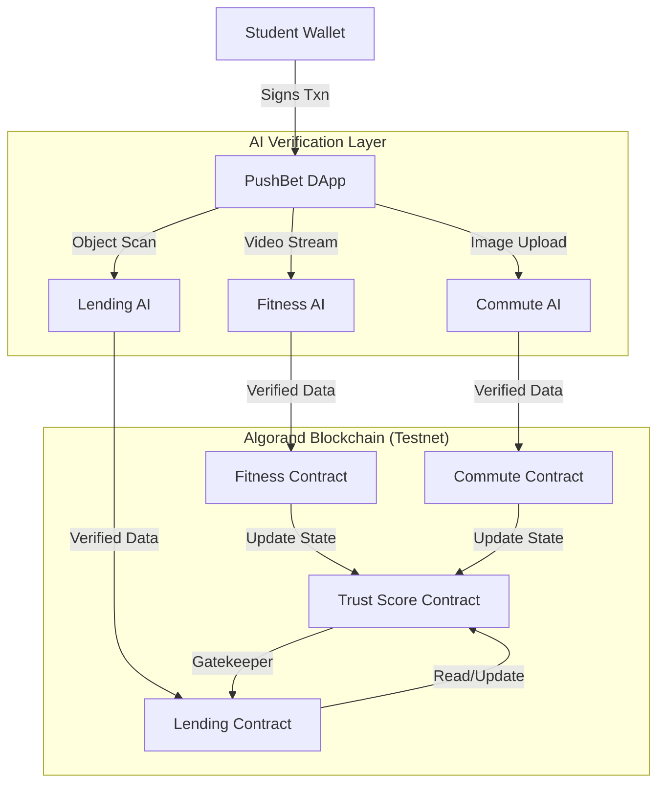

# 🚀 PushBet: The Decentralized Campus Vitality Protocol
### Built on Algorand | Powered by AI | Verified by Community

> **Hackathon Submission:** "Hackspiration '26" (Tracks: AI & Automation + Future of Finance)
> **Vision:** A trustless, self-governing ecosystem for campus life.

PushBet is not just an app; it is a **Decentralized Protocol** that gamifies and verifies student activities (Fitness, Commute, Lending) to build an on-chain **Reputation Score**.

---

## 🌟 The Core Innovation: "Trust Score Protocol"

Most campus apps are isolated silos. PushBet unifies them into a single **On-Chain Identity**.

**1. The "Trust Score" (Soulbound Token):**
*   Every verified action (100 pushups, 10 eco-rides, timely return of assets) mints **Trust Points** to your profile.
*   **High Trust Score = Real Utility:**
    *   **Zero-Collateral Borrowing:** If Trust > 90, borrow expensive lab equipment without locking 5 ALGO.
    *   **Validator Status:** Top-tier students become "Human Oracles" to verify others.

**2. The "Student Validator Node" (Decentralized AI):**
*   **Hybrid Verification:** AI (Gemini/TensorFlow) does the first pass.
*   **Human Consensus:** For edge cases, top-ranking students verify claims (e.g., "Is this room actually clean?").
*   **Incentive:** Verifiers earn small fees. Malicious voters get slashed.

---

## 💎 Key Features & Tracks

### 🧘 Track 2: AI & Automation
#### **A. Fitness Arena (Proof of Workout)**
*   **Tech:** **MediaPipe AI** tracks body pose in real-time.
*   **Action:** Counts push-ups via webcam.
*   **Result:** Mints "Strength" metadata to your profile.

#### **B. Commute Pool (Proof of Eco-Travel)**
*   **Tech:** **Gemini AI Vision** + **Geolocation**.
*   **Action:** Verifies you are sharing a ride (bus/carpool) to campus.
*   **Result:** Smart Contract releases payout to driver & mints "Eco" points.
*   **Testnet App ID:** `755284243`

#### **C. Asset Lending (Trustless Borrowing)**
*   **Tech:** **Coco-SSD (TensorFlow)** object detection.
*   **Action:** Verifies item condition upon return (Laptop, Phone).
*   **Result:** Auto-refunds collateral.

### 💰 Track 1: Future of Finance
#### **D. Atomic Marketplace (Zero-Risk Trading)**
*   **Tech:** **Algorand Atomic Transfers (Group Txns)**.
*   **Action:** Buy/Sell Textbooks, Notes, or Lab Coats peer-to-peer.
*   **Innovation:** Payment and Item Transfer happen in the *same* atomic group. If one fails, both fail. **Zero scams possible.**

#### **E. Cross-Chain Identity (State Proofs)**
*   **Tech:** **Algorand State Proofs (ASP)**.
*   **Action:** Export your high "Trust Score" as a cryptographic proof.
*   **Vision:** Use your Algorand reputation to get loans on other chains (Ethereum/Solana).

---

## 🏗️ Architecture



---

## 🏆 Why Algorand? (Technical Justification)

1.  **Atomic Transfers:** Used in our **Marketplace** to ensure trustless P2P trading without an escrow middleman.
2.  **Box Storage:** Used to store the **Global Order Book** and **User Reputation Data** directly on-chain (no centralized DB).
3.  **Low Latency (3.3s):** Essential for "Real-Time" verification. Students can't wait minutes for a gym rep to count.
4.  **State Proofs:** Positioned for future **Interoperability** of the Trust Score identity.

---

## 🚀 Quick Start (For Judges)

### Prerequisites
- **Node.js** (v18+)
- **Algorand Wallet** (Pera Mobile App recommended) connected to **TestNet**.
- **TestNet ALGO**: Get free funds from the [Algorand Dispenser](https://bank.testnet.algorand.network/).

### 1. Clone & Install
```bash
git clone https://github.com/miran786/PushBet--Algorand.git
cd PushBet--Algorand
npm install
```

### 2. Configure Environment
Create a `.env` file in the root directory:
```env
# Optional: Get a free key from Google AI Studio for Commute Verification
VITE_GEMINI_API_KEY="YOUR_GEMINI_API_KEY"
```

### 3. Run the App
```bash
npm run dev
```
Open **http://localhost:5173** (or the port shown in terminal).

---

## 🧪 How to Test (Demo Flow)

1.  **Commute:** Go to "Commute Arena" -> "Create Account" -> "I Need a Ride" -> "Start Trip" -> "Verify Arrival" (Gemini AI).
2.  **Lending:** Go to "Asset Arena" -> "Lender Mode" -> "Scan Item" (TensorFlow) -> "Borrower Mode" -> "Scan QR".
3.  **Fitness:** Go to "Arena" -> "Place Stake" -> Do Pushups (MediaPipe).

---

## 📜 Smart Contracts

| Contract | Testnet App ID | Description |
| :--- | :--- | :--- |
| **Commute** | `755284243` | Handles ride escrow, driver registry, and payouts. |
| **Asset** | *(Deployed per item)* | Manages collateral lock and return logic. |

---

### License
MIT
